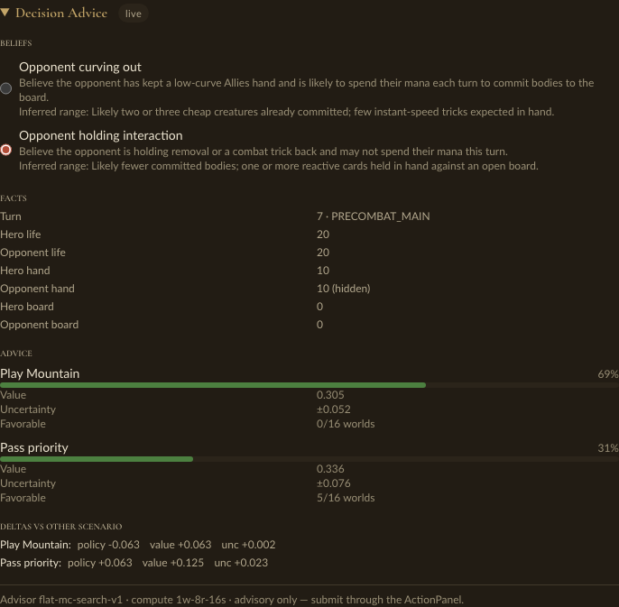

# Etude Fantasia

**Etude Fantasia** is an AI-assisted Pro Tour testing house for
[Magic: The Gathering](https://magic.wizards.com/), built by Loopflow Studio.

The game and the study session are one activity. Pilot a match, watch a human
or manabot, state a read about hidden information, compare how strategy changes,
try a line, and carry the same decision into Study. The aim is the feeling of a
great testing house: serious practice, visible disagreement, rapid experiments,
and the fun of discovering something together.

The first AI-assisted experience is one shared decision surface. It keeps the
visible facts, a viewer-safe belief, the advisor's complete strategy, and the
change from another belief separate. Changing “I think they are curving out”
to “I think they are holding interaction” should change the advice without
pretending either read is the hidden truth.



*Prototype shown: a checked fixture generated from real, identity-pinned
conditional-search evidence at one completed-match decision. The same component
renders in the play and replay/Study hosts today. Binding it to the actual live
or selected replay decision, player-authored belief entry, Retry and return,
and shared watcher roles are still being connected.*

## What runs today

Etude currently plays a curated one-versus-one game on an authoritative
semantic table. A human can face search, random play, or a checkpoint-backed
manabot; ordinary legal Commands drive the match; semantic presentation,
recovery, finished-game replay, and viewer-safe decision and evidence contracts
share the same rules authority.

The first belief-to-strategy prototype offers two pinned viewer-safe scenarios
at one canonical decision. Selecting either scenario shows the complete legal
action distribution, search values, sampled-world robustness, uncertainty,
and explicit deltas from the other scenario. The evidence is reproducible and
fails closed when its decision, replay, advisor, or compute identity does not
match. It is fixture-backed advice, not yet a runtime advisor for the current
board.

## The destination: Avatar Cube Team Sealed

Etude is building toward Avatar Cube Team Sealed: two teams receive 135-card
pools from a versioned 540-card cube, construct three 40-card-minimum decks with
unlimited basics and deck-specific sideboards, and play the full three-by-three
deck matchup matrix until one team reaches five wins. Every game remains an
independent canonical match that the testing house can reopen in Study.

Humans choose which seats they pilot. Manabots fill the remaining seats as
teammates and opponents, and can also serve as sparring partners and advisors.
Game owns the construction experience; Intelligence will eventually build the
three legal decks from a shared sealed pool. A versioned, world-pinned Elo arena
will measure manabots at declared compute classes with paired-deal uncertainty
and explicit promotion gates.

The Avatar destination guides the interfaces, but the next product is still
the smallest polished loop: one selected match that is excellent to play,
replay, Retry, compare, and Study.

## Product laws

- Viewer-safe match facts, player-authored beliefs, model-inferred beliefs, and
  advice are distinct evidence. None silently becomes another.
- The same decision, belief, advisor, compute class, and provenance identity
  produces the same advice whether reached live or through Study.
- Only the acting pilot can commit the live offered `Command`.
- Watching, comparing beliefs, and exploring an isolated line never pause or
  mutate the authoritative match.
- Etude owns the canonical decisions and artifacts a testing group discusses.
  Discord remains the human communication layer; Etude does not build chat.

## Play

You need [uv](https://docs.astral.sh/uv/), Node, and a Rust toolchain. Then:

```bash
git clone git@github.com:loopflowstudio/etude.git
cd etude
./scripts/play
```

One command installs locked dependencies, builds the engine, starts the
backend and frontend, and opens the curated matchup in your browser. Ctrl-C
stops both services. The path from a fresh checkout to play is itself under
test: `./scripts/verify-clean-machine` proves launch within 60 seconds, offline
reload, and session recovery, and CI records the receipt (see
[docs/clean-machine-play.md](docs/clean-machine-play.md)).

## Continue into Study

A finished game is study material, not an export to another product. The Study
contract gives every historical player decision a stable viewer-safe address
and preserves the exact frame, offer, played Command, semantic event cursor,
and attributable evidence needed to inspect, Retry, compare, and return. The
guided Retry and comparison experience is still being connected to the shared
table. The versioned experience and Study schemas live in
[protocol/](protocol/README.md); the folded roadmap is
[wave/study/](wave/study/GOAL.md).

## Train a manabot

```bash
uv run manabot train
```

The default preset trains a small manabot on your laptop's CPU in under a
minute—no accounts, no GPU—and saves checkpoints to `.runs/local/`. Then face
what you trained: in the play screen's opponent selector, choose
**Checkpoint** and point it at your `.runs/local/step_*.pt`. Play, train, play
against your own manabot: that loop is the project.

Serious runs train on Ubuntu machines in AWS and track to Weights & Biases.
Simulation pulls trained models and can run locally on CPU. See
[manabot/README.md](manabot/README.md) for the training and simulation
quickstart, presets, and the current world's live baselines.

## How the system divides responsibility

Etude Fantasia is built from three cooperating systems:

- **Etude** (`etude`, Python + Svelte): the authored play, replay, Retry,
  comparison, and Study experience
- **manabot** (`manabot`, Python): trainable agents, beliefs, planning,
  evidence, evaluation, and experiment tracking
- **managym** (Rust): deterministic rules and match authority, viewer-safe
  observations, typed possible worlds and queries, exact forks, and PyO3
  Python bindings

The governing contract is [docs/ARCHITECTURE.md](docs/ARCHITECTURE.md). In
short: managym owns facts and legality, manabot owns inference and advice, and
Etude owns what the player sees and does.

## The research ledger

Etude's research program is preregistered and reproducible: every experiment
states its prediction, budget, and kill criteria before running, and negative
results are recorded alongside positive ones.

- [experiments/](experiments/README.md) — the experiment ledger and frozen
  contracts
- [manabot/RESEARCH.md](manabot/RESEARCH.md) — the agent research thesis,
  evidence map, skill-rating contract, and capability frontiers
- [WORLDS.md](WORLDS.md) — observation/action world versioning and which
  baselines are alive
- [wave/](wave/README.md) — the active rules, game, folded Study, and
  intelligence portfolios
- [docs/ARCHITECTURE.md](docs/ARCHITECTURE.md) — the top-down authority,
  identity, replay, belief, search, learning, arena, and Study map
- [docs/research/](docs/README.md) — platform comparisons and deep dives
- [paper/](paper/README.md) — the paper

## Development

```bash
# Install locked Python dependencies
uv sync --python 3.12 --extra dev

# Build and install the managym extension
uv run --python 3.12 --extra play maturin develop --release \
  --manifest-path managym/Cargo.toml --features python

# Rust checks (CI runs cargo test in debug; validate in debug before landing)
cd managym && cargo fmt --check && cargo clippy --all-targets --all-features -- -D warnings && cargo test && cd ..

# Python tests
uv run --extra dev pytest tests/
```

Package structure and style live with [etude/](etude/README.md),
[manabot/](manabot/README.md), and [managym/](managym/README.md). Agent and
contributor conventions are in [AGENTS.md](AGENTS.md).

## Map of the repository

| Path | What it is |
|---|---|
| `etude/` | Experience server: transport, presentation, Study protocol, and adapters over managym authority |
| `frontend/` | Etude's Svelte client |
| `manabot/` | The trainable agent: env wrappers, models, search, training, verification |
| `managym/` | Rust rules engine and vectorized environment (PyO3 bindings) |
| `protocol/` | Versioned experience/Study schemas certified across Rust, Python, and TypeScript |
| `content/` | Curated deck content compiled to typed semantic IR |
| `conformance/` | Semantic kernel conformance fixtures |
| `experiments/` | Preregistered experiment ledger, contracts, receipts |
| `wave/` | Active research and product portfolios and their charters |
| `docs/` | Architecture, research, rules, and benchmark documentation |
| `paper/` | The paper |
| `ops/` | AWS training infrastructure and container images |
| `scripts/` | Entry points (`play`, `verify-clean-machine`) and benchmarks |

## Naming

- **Etude Fantasia** — the full project name and the product experience.
- **Etude** — the short name wherever brevity or machine identity matters:
  repository, service namespaces, and ordinary prose after first mention.
  Always ASCII (never “Étude”).
- **manabot** — the agent and the Python training library/CLI. Indefinite noun:
  you train *a* manabot.
- **managym** — the rules environment the agent lives in.

If it faces the player, it is Etude; if it trains or evaluates the agent, it
is manabot; if it is the world, it is managym. manabot is not a former name to
erase: existing `manabot.*` contract/schema identifiers, experiment receipts,
and wandb history keep their names and remain reproducible.
