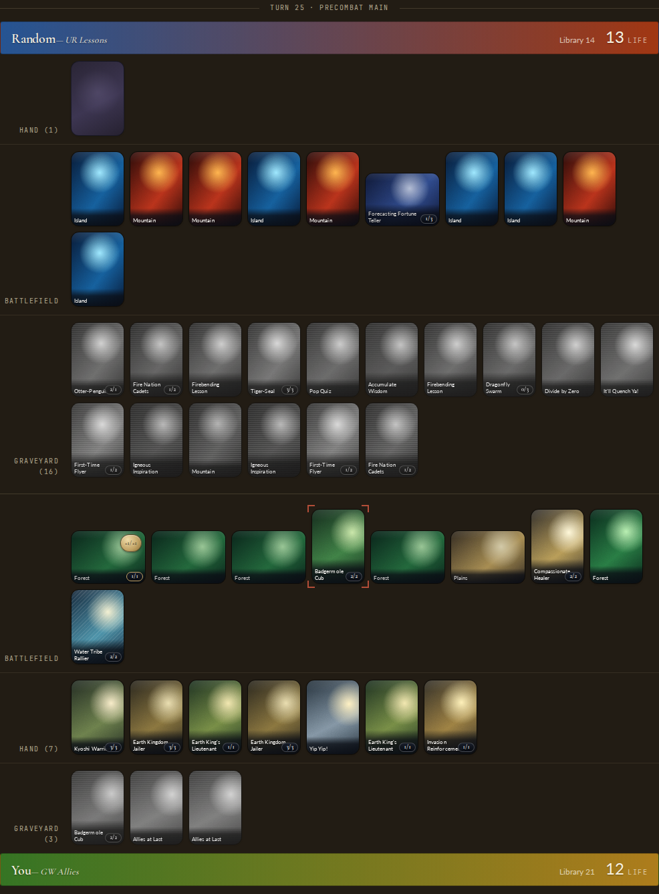

# Etude Fantasia

**Etude Fantasia** is a way to study
[Magic: The Gathering](https://magic.wizards.com/) built by Loopflow Studio.

Etude is playable by both humans and robots, and is designed to support the
development of intelligent Magic: The Gathering robots to support the
development of intelligent Magic: The Gathering humans.

Etude Fantasia is built out of three main subsystems:
- **Etude** (`etude`, Python + Svelte frontend): the authored play, replay,
  and study experience
- **Manabot** (`manabot`, Python): the trainable agent, search and learning
  library, Gymnasium wrappers, and experiment tracking
- **managym** (Rust): the deterministic game and search environment, with PyO3
  Python bindings



## Play

You need [uv](https://docs.astral.sh/uv/), Node, and a Rust toolchain. Then:

```bash
git clone git@github.com:loopflowstudio/etude.git
cd etude
./scripts/play
```

One command installs locked dependencies, builds the engine, starts the
backend and frontend, and opens the curated matchup against a trained manabot
in your browser. Ctrl-C stops both services. The path from a fresh checkout
to play is itself under test: `./scripts/verify-clean-machine` proves launch
within 60 seconds, offline reload, and session recovery, and CI records the
receipt (see [docs/clean-machine-play.md](docs/clean-machine-play.md)).

## Study

A finished game is study material. The Study surface restores consequential
decisions as the player understood them, shows what else was worth
considering, and lets you retry a line before the reveal — all projections of
the same rules authority that played the game. The experience protocol,
viewer-safe decision artifacts, and study schema are in place
([protocol/](protocol/README.md)); the guided review experience is being
built under [wave/study/](wave/study/GOAL.md).

## Train a manabot

```bash
uv run manabot train
```

The default preset trains a small manabot on your laptop's CPU in under a
minute — no accounts, no GPU — and saves checkpoints to `.runs/local/`.
Then face what you trained: in the play screen's opponent selector, choose
**Checkpoint** and point it at your `.runs/local/step_*.pt`. Play, train,
play against your own manabot — that loop is the project.

Serious runs train on Ubuntu machines in AWS and track to Weights & Biases.
Simulation pulls trained models and can run locally on CPU. See
[manabot/README.md](manabot/README.md) for the training and simulation
quickstart, presets, and the current world's live baselines.

## The research ledger

Etude's research program is preregistered and reproducible: every experiment
states its prediction, budget, and kill criteria before running, and negative
results are recorded alongside positive ones.

- [experiments/](experiments/README.md) — the experiment ledger and frozen
  contracts
- [WORLDS.md](WORLDS.md) — observation/action world versioning and which
  baselines are alive
- [wave/](wave/README.md) — the active portfolios: rules, game, study,
  intelligence
- [docs/research/](docs/README.md) — platform comparisons and deep dives
- [paper/](paper/README.md) — the paper

## Development

```bash
# Install locked Python dependencies
uv sync --python 3.12 --extra dev

# Build and install the managym extension
uv run --python 3.12 --extra play maturin develop --release \
  --manifest-path managym/Cargo.toml --features python

# Rust checks (CI runs cargo test in debug; validate in debug before landing)
cd managym && cargo fmt --check && cargo clippy --all-targets --all-features -- -D warnings && cargo test && cd ..

# Python tests
uv run --extra dev pytest tests/
```

Architecture and style live with their packages: [etude/](etude/README.md),
[manabot/](manabot/README.md), [managym/](managym/README.md). Agent and
contributor conventions are in [AGENTS.md](AGENTS.md).

## Map of the repository

| Path | What it is |
|---|---|
| `etude/` | Experience server: authoritative play, presentation, study protocol, curated packs |
| `frontend/` | Etude's Svelte client |
| `manabot/` | The trainable agent: env wrappers, models, search, training, verification |
| `managym/` | Rust rules engine and vectorized environment (PyO3 bindings) |
| `protocol/` | Versioned experience/study schemas certified across Rust, Python, TypeScript |
| `content/` | Curated deck content compiled to typed semantic IR |
| `conformance/` | Semantic kernel conformance fixtures |
| `experiments/` | Preregistered experiment ledger, contracts, receipts |
| `wave/` | Active research/product portfolios and their charters |
| `docs/` | Architecture, research, rules, and benchmark documentation |
| `paper/` | The paper |
| `ops/` | AWS training infrastructure and container images |
| `scripts/` | Entry points (`play`, `verify-clean-machine`) and benchmarks |

## Naming

- **Etude Fantasia** — the full project name and the product experience.
- **Etude** — the short name wherever brevity or machine identity matters:
  repository, service namespaces, and ordinary prose after first mention.
  Always ASCII (never "Étude").
- **manabot** — the agent, and the Python training library/CLI. Indefinite
  noun: you train *a* manabot.
- **managym** — the rules environment the agent lives in.

If it faces the player, it is Etude; if it trains or evaluates the agent, it
is manabot; if it is the world, it is managym. Manabot is not a former name
to erase: existing `manabot.*` contract/schema identifiers, experiment
receipts, and wandb history keep their names and remain reproducible.
